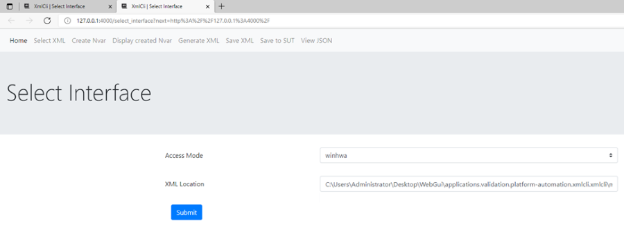

Installation
============
This step is required for the first time for environment setup for module.

1. Install requirement from PyPI
  ```shell
  python -m pip install xmlcli[webgui]
  ```
  > Note: if you face Network connection timeout means, you may need to setup valid proxy settings.


Usage Instruction
=================
Method 1

1. Launch Python shell as Elevated Privilege. [As Root/Admin user]
2. Run below command to launch GUI
  ```python
  from xmlcli import XmlCli as cli
  cli.helpers.launch_web_gui()
  ```

  Output would look similar to:

  ```shell
   * Serving Flask app 'xmlcli.modules.webgui.main'
   * Debug mode: off
  WARNING: This is a development server. Do not use it in a production deployment. Use a production WSGI server instead.
   * Running on all addresses (0.0.0.0)
   * Running on https://127.0.0.1:4000
  ```

3. GUI will open in the browser

  

4. Select the Access Mode and XML Location accordingly. (Here in this use case we are selecting `linux` as Access Mode.) and Click on `Submit`

| Example             | Document                                                  |
|---------------------|-----------------------------------------------------------|
| Create New Nvar     | [creating_nvar.md](examples/creating_nvar.md)             |
| Modify Created Nvar | [change_created_nvar.md](examples/change_created_nvar.md) |
| Nvar Xml Structure  | [nvar_xml_structure.md](examples/nvar_xml_structure.md)   |
