Modify **Value** of Existing Nvar
=============================
1. Click on the `Display created Nvar` to view the NVAR created as per [this](creating_nvar.md) document.

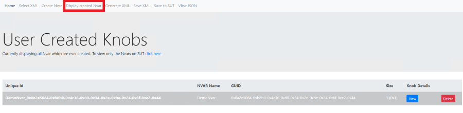

2. click on `View` to view the Knobs inside the NVAR.

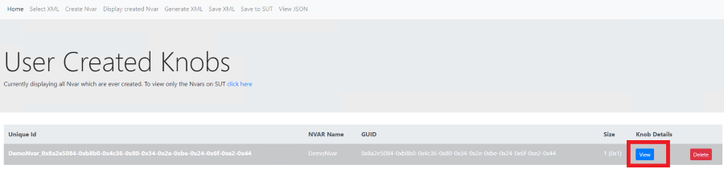

3. Click on `Edit` to edit the values of the Knob.

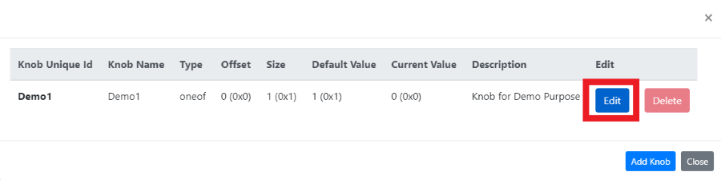

4. in `Current_value` add the value you wish to change and click on `Save`.
you can view the Change in Current value in the GUI

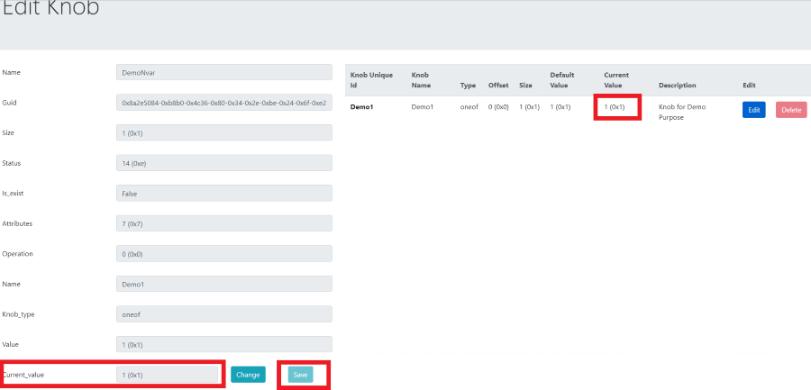

5. Click on `Save XML` to save the contents into XML file permanently.

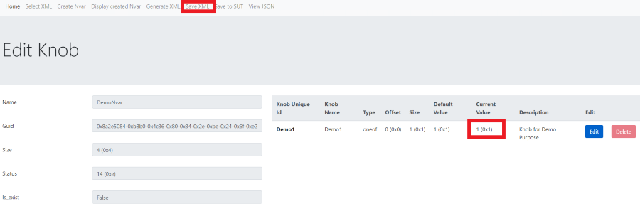

6. XML before changing the value of knobs in the Existing Nvar.

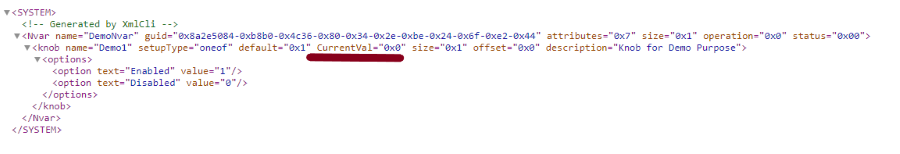

7. XML after changing the value of knobs in the Existing Nvar.

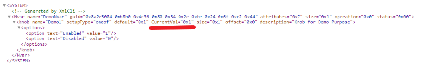

8. To update Nvar values to the SUT click on `Save to SUT`.

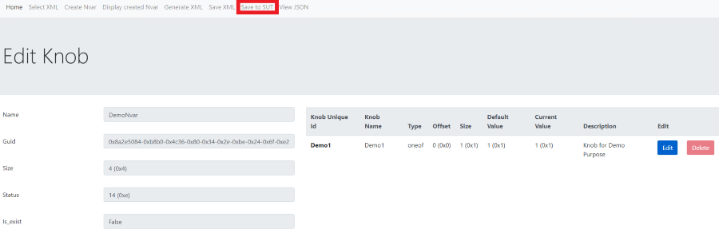

9. Select the XML file and Click on `Submit`. It will save the Nvar to SUT.

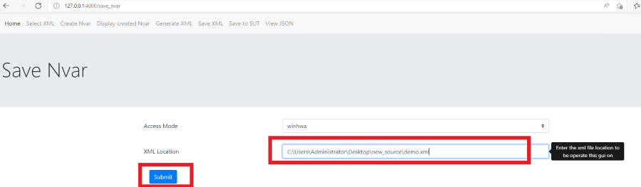

10. To validate the value in the BIOS you can use [dmpstore](https://techlibrary.hpe.com/docs/iss/proliant-gen10-uefi/GUID-BB84420D-33A4-48A8-BEFD-21C2079FC863.html).
    `dmpstore` syntax and usage available at page number 129 in [this](https://uefi.org/sites/default/files/resources/UEFI_Shell_2_2.pdf) document.

Modify **Structure** of created Nvar
================================
1. Click on the `Display created Nvar` to view the NVAR created as per [this](creating_nvar.md) document.

2. Click on `View` to view the Knobs inside the NVAR

3. Click on `Add Knob` to add the new knobs to the NVAR

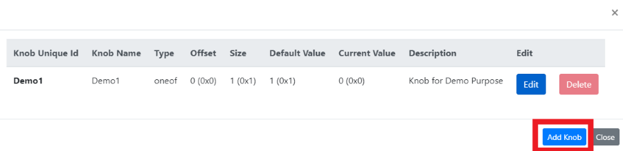

4. Select the `Knob Type` (in this example we have used Numeric) and provide the corresponding values

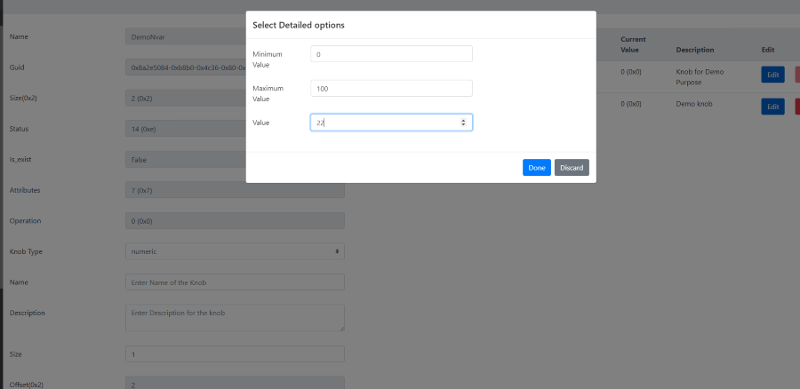

5. Provide Name, Description and Size and other details for the Knob.Then Refresh the page to view the Knobs created.

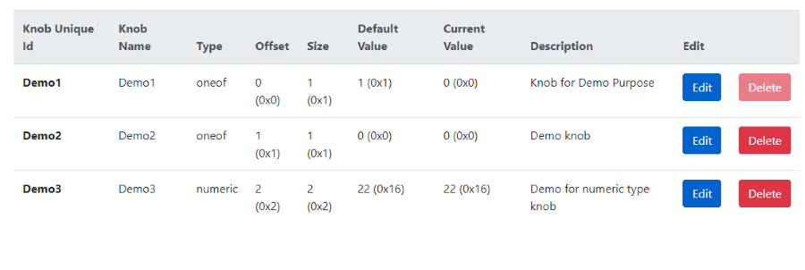

6. Click on `Save XML` to save the contents into XML file permanently.

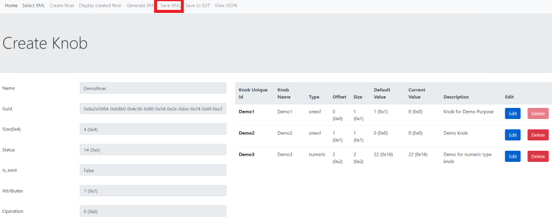

7. XML before Modifying the Structure of created the Nvar

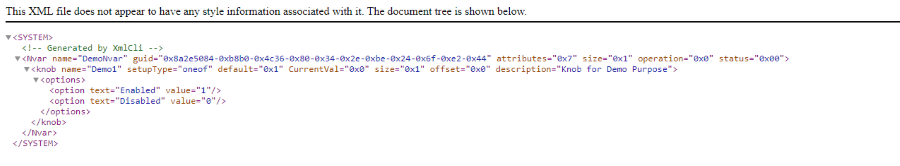

8. XML after Modifying the Structure of created the Nvar

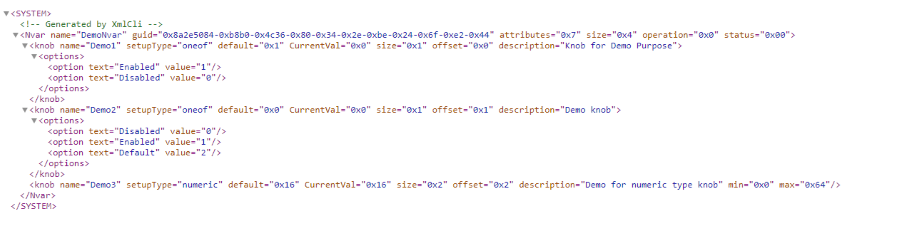

9. To update Nvar values to the SUT click on `Save to SUT`.

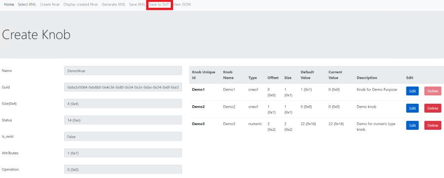

10. Select the XML file and Click on `Submit`. It will save the Nvar to SUT.

11. To validate the value in the BIOS you can use [dmpstore](https://techlibrary.hpe.com/docs/iss/proliant-gen10-uefi/GUID-BB84420D-33A4-48A8-BEFD-21C2079FC863.html).
    `dmpstore` syntax and usage available at page number 129 in [this](https://uefi.org/sites/default/files/resources/UEFI_Shell_2_2.pdf) document.
