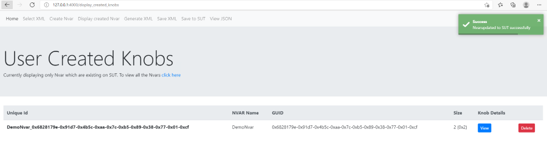

Creating Nvar
==============

1. Click on `Create Nvar`
2. Add Meaningful name to `NVAR name`
3. Add `GUID` (you can use default one created by GUI)
4. Add `Attributes`  (0x07 , Non-volatile,Boot-Time and Runtime)
5. Click on `Submit`

6. Once you click on `Submit` you can see the Created Nvar highlighted.

7. Click on `View` to view the Knobs created.
8. Click on `Add Knob` to Add Knobs for the Nvar created.
9. Select appropriate `Knob Type` among the following [oneof, string, numeric, checkbox, reserved] (for the below example we have considered oneof)

10. Add the Knob details

11. Provide Name, Description, Size and click on `Save and Create`

12. Refresh the page to view the Knob created.

14. Click on 'Display created Nvar' to view the crated Nvar. You can view, edit and Add Knobs.
15. Click on 'Generate XML' to generate the XML file with Created Nvar and Knob details

16. Click on 'Save XML' to save the contents into XML file permanently.
17. To Add the created Nvar to the SUT click on `Save to SUT` and select the XML file and Click on `Submit`

On Successful save to SUT, the Created Nvar will be not highlighted.

17. Click on `View JSON` to view in JSON format
